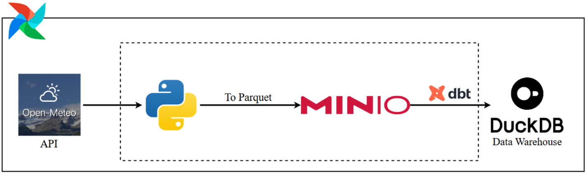
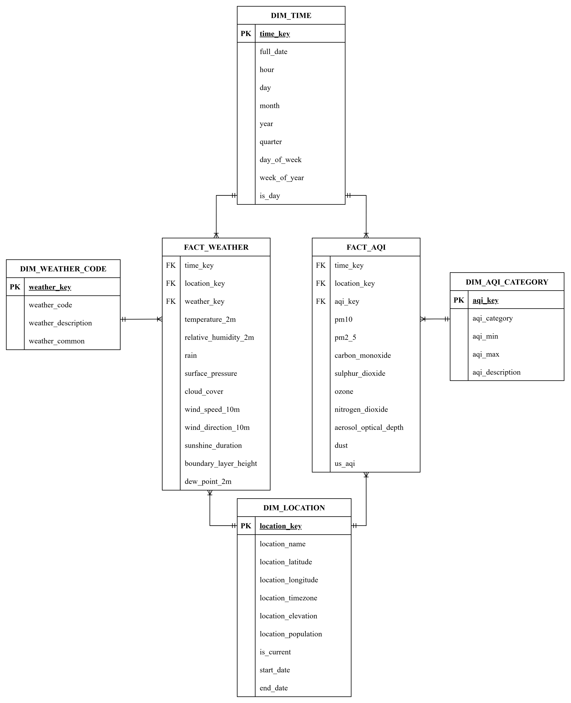

# AQI Analytics in Southeast Vietnam

An automated ELT pipeline that collects, processes, and analyzes **Air Quality Index (AQI)** and **Weather** data across provinces and cities in Southern Vietnam. Data is organized into a Data Warehouse using a **Galaxy Schema** and visualized through Metabase.

---

## Introduction

### Goals:

- Build a **Data Warehouse** that stores hourly AQI and weather data for provinces and cities across Southern Vietnam.
- Automate the full data lifecycle from ingestion to visualization with no manual steps needed.
- Model the data as a **Galaxy Schema** (2 Fact tables, 4 Dimension tables) to support analytical (OLAP) queries.
- Provide exploratory and predictive analysis of air quality trends using ML models.

### APIs

| API                                                                          | Crawl frequency |
| ---------------------------------------------------------------------------- | --------------- |
| [Open-Meteo Air Quality API](https://open-meteo.com/en/docs/air-quality-api) | Daily           |
| [Open-Meteo Weather API](https://open-meteo.com/en/docs)                     | Daily           |
| [Open-Meteo Geocoding API](https://open-meteo.com/en/docs/geocoding-api)     | By Used         |

### Tech stack:

<p align="center">
  
</p>

### Flow:

...

---

## Diagrams

**Galaxy Schema**:

<p align="center">
  
</p>

## Dashboard

The visualization report is built in Metabase: [Dashboard](dashboard/full.pdf)

---

## Setup

### Initial:

```bash
git clone https://github.com/Avcuongy/AQI-Analytics-in-Southeast-Vietnam.git

cd AQI-Analytics-in-Southeast-Vietnam

python -m venv .venv

.venv\Scripts\Activate.ps1

pip install -r requirements.txt

pip install -e .

docker compose up -d
```

Access:

- Airflow UI: http://localhost:8080
- Metabase UI: http://localhost:3001
- MinIO: http://localhost:9001

### Ingest historical:

```bash
# Local
python scripts/all/dowloader.py
python scripts/all/load_to_storage.py
python scripts/all/sync_duckdb_to_postgres.py

# Docker
docker exec -it airflow-scheduler python /opt/airflow/project/scripts/all/dowloader.py
docker exec -it airflow-scheduler python /opt/airflow/project/scripts/all/load_to_duckdb.py
docker exec -it airflow-scheduler python /opt/airflow/project/src/elt/sync_duckdb_to_postgres.py
```
